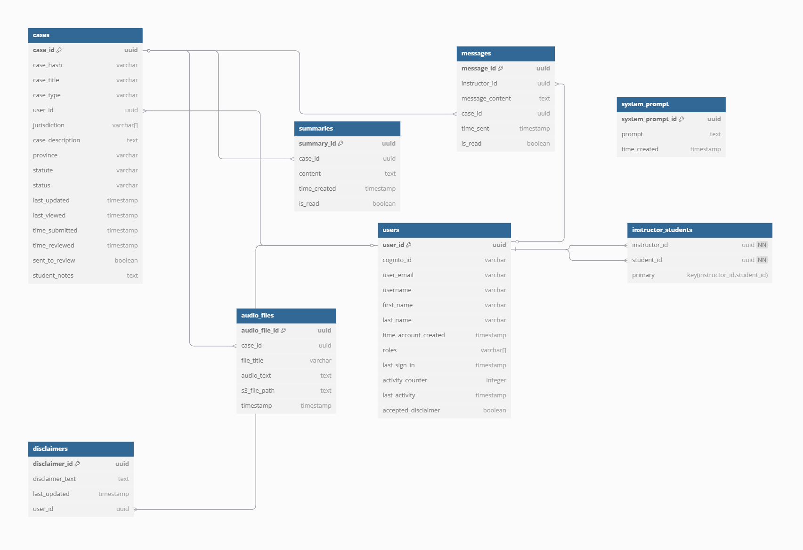

# Architecture Deep Dive

## Architecture

1. The user request is first sent through a security layer which comprises of AWS WAF, Amazon Cloudfront, and AWS Shield for flagging any potential threats.
2. Users then access the application through a React frontend hosted on AWS Amplify. AWS Cognito handles user authentication, ensuring that only authorized users can log in and interact with the platform.
3. The frontend communicates with backend services via two APIs:

-  **REST API (API Gateway → Lambda)** for CRUD operations and presigned URLs

- **GraphQL API (AppSync)** for real-time updates via subscriptions.
Access is controlled using IAM roles and policies.
4. When a user uploads an audio file, a presigned url is generated which is stored in an S3 bucket. An AWS Lambda function monitors the bucket, retrieves the audio file, and prepares it for transcription processing. Amazon Transcribe processes the uploaded audio file and converts it into text. After the transcription is complete, Amazon AppSync sends a real-time WebSocket notification back to the frontend to update the user interface.
5.	Metadata related to the audio file and its transcription, such as timestamps and case id, is securely stored in an Amazon RDS database via an RDS Proxy to optimize database connections.
6.	Users can create, edit or delete cases which triggers a lambda function. 
7. This Lambda function interacts with the RDS to change the data. 
8. This data from RDS is retrieved by Amazon Bedrock when text generation Lambda is triggered. 
9. For AI-powered text generation (e.g., summarizations, title generation), AWS Lambda triggers Amazon Bedrock, which runs the Llama 3 model after retrieving relevant information from Amazon RDS database.
10.	The conversation history are stored in Amazon DynamoDB. This provides fast retrieval and scalability, allowing users to view past interactions efficiently.

AWS CodePipeline and CodeBuild automates Docker image builds and Lambda deployments for seamless backend updates.

### Database Schema

### RDS Tables

### `users` table

| Column Name          | Description                                           |
| -------------------- | ----------------------------------------------------- |
| `user_id`            | UUID, primary key                                     |
| `cognito_id`         | Cognito identity ID                                   |
| `user_email`         | Unique email of the user                              |
| `username`           | Chosen username                                       |
| `first_name`         | First name                                            |
| `last_name`          | Last name                                             |
| `time_account_created` | Timestamp of account creation                       |
| `roles`              | Array of user roles (e.g., student, instructor, admin)|
| `last_sign_in`       | Timestamp of last sign-in                             |
| `activity_counter`   | Number of AI messages sent in the last 24 hours       |
| `last_activity`      | Timestamp of the last AI message sent                 |

### `messages` table

| Column Name      | Description                                |
| ---------------- | ------------------------------------------ |
| `message_id`     | UUID, primary key                          |
| `instructor_id`  | UUID of instructor (FK to `users`)         |
| `message_content`| Text content of the message                |
| `case_id`        | UUID of associated case (FK to `cases`)    |
| `time_sent`      | Timestamp when the message was sent        |
| `is_read`        | Whether the message has been read          |

### `system_prompt` table

| Column Name        | Description                         |
| ------------------ | ----------------------------------- |
| `system_prompt_id` | UUID, primary key                   |
| `prompt`           | System-wide system prompt           |
| `time_created`     | Timestamp when the prompt was added |

### `instructor_students` table

| Column Name     | Description                                  |
| --------------- | -------------------------------------------- |
| `instructor_id` | UUID of instructor (FK to `users`)           |
| `student_id`    | UUID of student (FK to `users`)              |

### `cases` table

| Column Name        | Description                                      |
| ------------------ | ------------------------------------------------ |
| `case_id`          | UUID, primary key                                |
| `case_hash`        | Unique hash for identifying the case (in base64) |
| `case_title`       | Title of the case                                |
| `case_type`        | Type of legal case                               |
| `user_id`          | UUID of creator (FK to `users`)                  |
| `jurisdiction`     | Array of jurisdictions (e.g., Federal, Provinical)|
| `case_description` | Description of the case                          |
| `status`           | Status of the case (default: "In progress")      |
| `last_updated`     | Timestamp of last update                         |
| `time_created`     | Timestamp when the case was created              |
| `time_submitted`   | When the case was submitted                      |
| `time_reviewed`    | When the case was reviewed                       |
| `sent_to_review`   | Boolean: has it been sent for review             |
| `student_notes`    | Notes added by the student (default: empty)      |

### `summaries` table

| Column Name   | Description                            |
| ------------- | -------------------------------------- |
| `summary_id`  | UUID, primary key                      |
| `case_id`     | UUID of related case (FK to `cases`)   |
| `content`     | Summary content                        |
| `time_created`| Timestamp of when it was created       |
| `is_read`     | Boolean: whether the summary was read  |

### `audio_files` table

| Column Name       | Description                                |
| ----------------- | ------------------------------------------ |
| `audio_file_id`   | UUID, primary key                          |
| `case_id`         | UUID of related case (FK to `cases`)       |
| `audio_text`      | Transcribed text from audio                |
| `s3_file_path`    | File path to audio on S3                   |
| `timestamp`       | Timestamp when the audio was uploaded      |

### `disclaimers` table

| Column Name       | Description                                |
| ----------------- | ------------------------------------------ |
| `disclaimer_id`   | UUID, primary key                          |
| `disclaimer_text` | Text to be shown to student upon sign up   |
| `last_updated`    | Date of last update of the disclaimer      |
| `user_id`         | UUID of user updating (FK to `users`)      |
